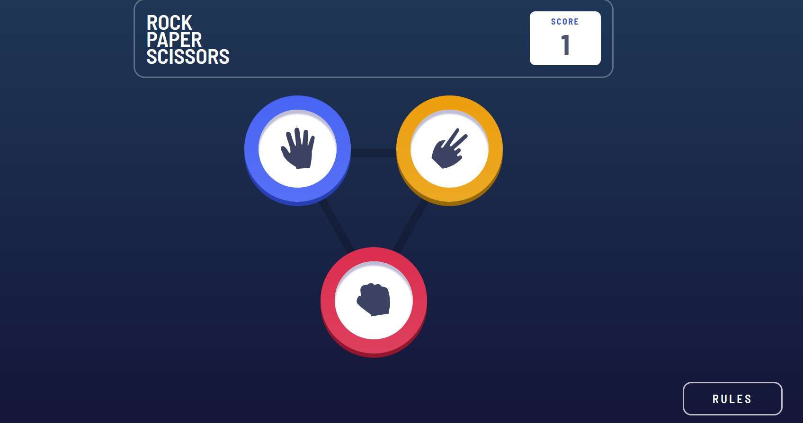

# Frontend Mentor - Rock, Paper, Scissors solution

This is my solution to the [Rock, Paper, Scissors challenge on Frontend Mentor](https://www.frontendmentor.io/challenges/rock-paper-scissors-game-pTgwgvgH).

## Table of Contents

- [Overview](#overview)
    - [Screenshot](#screenshot)
    - [Links](#links)
- [My process](#my-process)
    - [Built with](#built-with)
    - [What I learned](#what-i-learned)
    - [Continued development](#continued-development)
    - [Useful resources](#useful-resources)
- [Author](#author)

## Overview

### Screenshot

### Links

Solution URL: [Rock, Paper, Scissors solution](https://www.frontendmentor.io/solutions/rock-paper-scissors-solution-oLntHjLkrb)

Live Site Url: [Rock, Paper, Scissors live](https://rock-paper-scissors-chi-flame.vercel.app/)

## My process

### Built with

- HTML5 markup
- CSS custom properties
- Flexbox
- Javascript
- More Javascript 

### What I learned

This challenge helped me to develop my Javascript skills even more. The fact that I had to code scripts to calculate the machine's options, results, when to start the animations and where to place some elements makes me feel like I'm improving and have more control over what I do or don't with javascript.

### Continued development

One thing I want to keep doing is coding using Javascript. I think it has a lot of power and control in web development and learning to code like a pro could be one of the things every web developer should know.

### Useful resources

[Animate.css](https://animate.style/) - This library helped me add animations to elements and make the web a bit more dynamic.
[Google Fonts](https://fonts.google.com/) - Where I get the fonts I will use, what else can I say?
[Bootstrap icons](https://icons.getbootstrap.com/) - Icon library I use to add some icons throughout the web.

## Author

- Frontend Mentor - [@dan-ec05](https://www.frontendmentor.io/profile/dan-ec05)